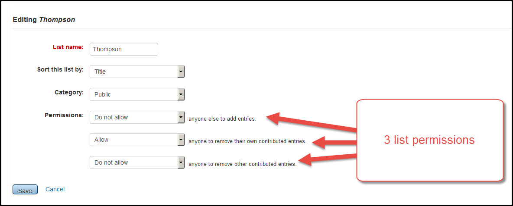
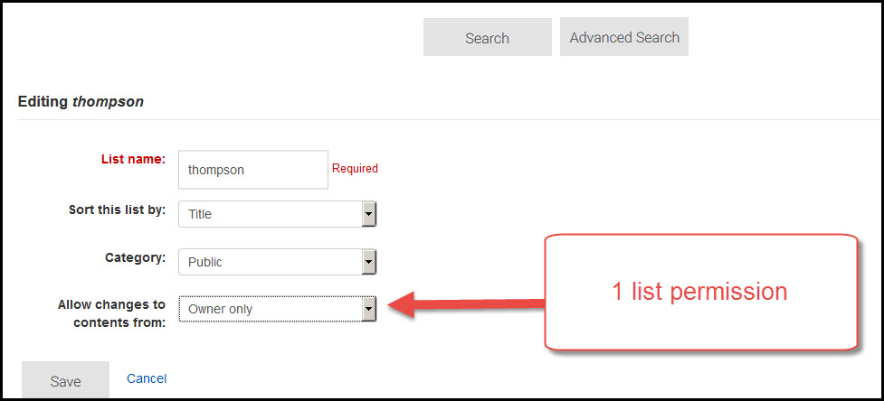

# Lists

***
## List permissions

As in the staff client, the current version has separate controls allowing the list owner to to control whether or not others can add to a list, delete things they have added to a list, or delete things others have added to a list.  The controls and instructions for using these features were confusing.  

Current version:

New version:

The new version allows patrons to block all editing on a list (once the list is created even the owner can't take things off of it); give anyone full permission to add or remove items from a list; or to allow only themselves to add or remove items from a list.

***
