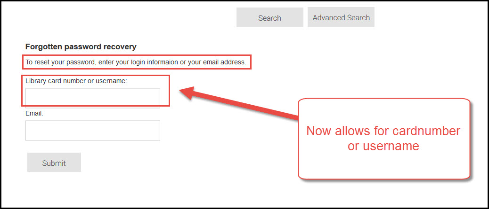
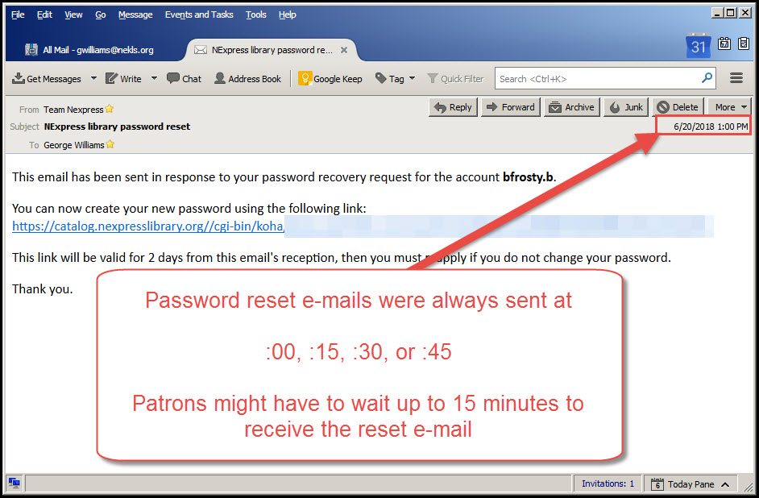
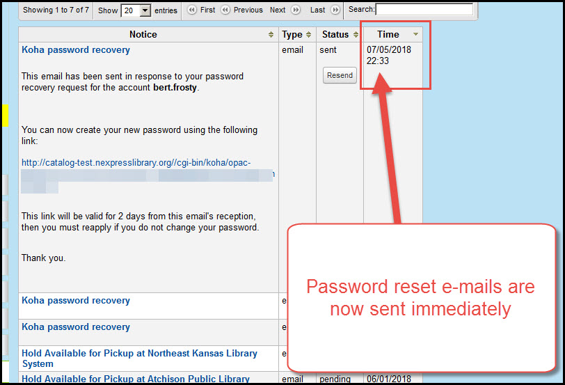
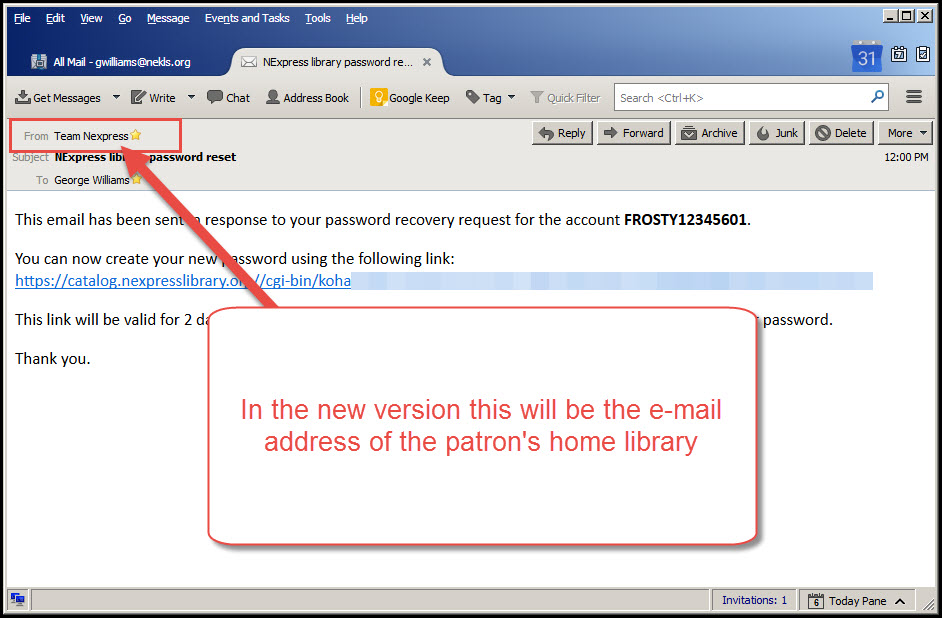
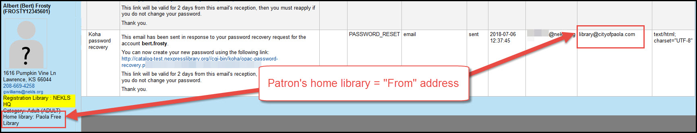
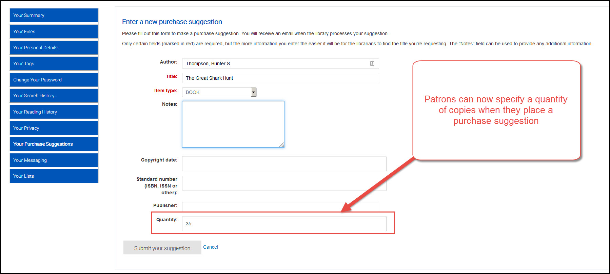
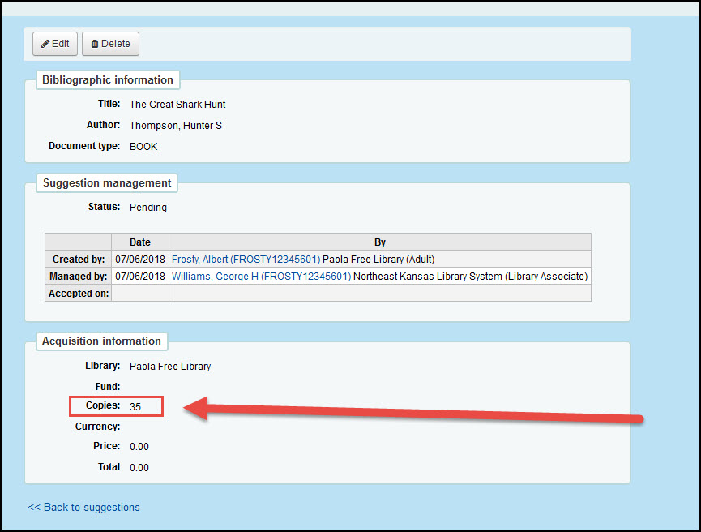

# Patron

***
## New "Forgot your password" options

Version 16.11 added a "Forgot your password" feature to the OPAC.  This feature required that a patron enter their username and e-mail address and then the system would automatically e-mail them within 15 minutes with a password reset link.

The new version keeps the feature but modifies it so that patrons can enter:

* Their username
* Their library card number

-or-

* Their e-mail address (provided no one else has that e-mail address on their account)

If more than one patron uses the same e-mail address, then they must enter their username or their library card number in addition to the e-mail address.  And, of course, if the patron does not have an e-mail address saved in their account, they cannot receive a password reset e-mail at all.

***

## "Forgot your password" e-mail speed

When the "Forgot your password" feature was added, the e-mails were added to the normal e-mail queue (which we had set to send at :15 minutes past the hour and quickly updated to send at :00, :15, :30, and :45 minutes past each hour).  This meant that patrons might have to wait a very long time before they received the link to reset their password.

The new version sends the e-mails instantly so patrons should be able to unlock their accounts more quickly.

Current version:

New version:

***

## "Forgot your password" e-mail address

When the "Forgot your password" feature was added, the e-mails were sent from the system-wide teamnexpress@nekls.org e-mail address.  If a patron does not normally receive e-mail from teamnexpress@nekls.org, this meant that the e-mails were more likely to be filtered as Spam.

The new version sends uses the default address for the patron's home library as the "From address" for the password re-set e-mail.

***

## Purchase suggestion quantity

Whe patrons place a purchase suggestion in the OPAC, they can now specify the number of copies they're suggesting that the library purchase.

In the OPAC you see the quantity on the purchase suggestion form:

Once the suggestion is placed, staff see the quantity requested in the specific suggestion:

***
