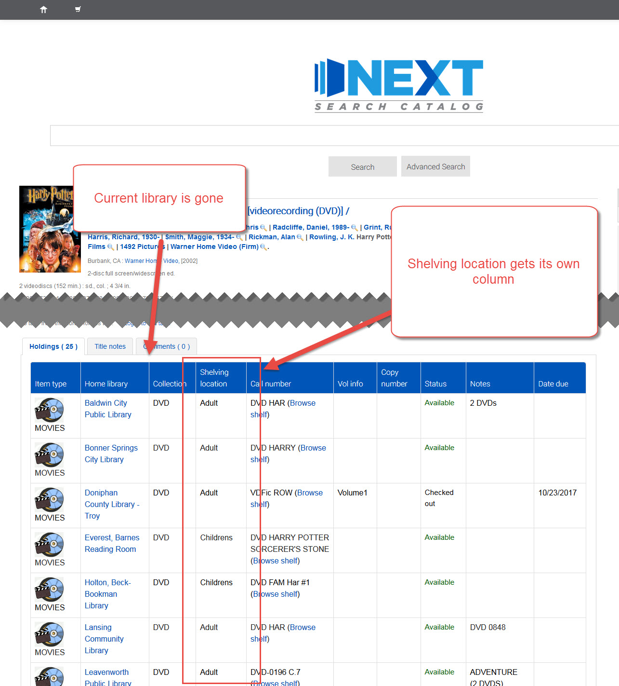

# Searching

***
## Shelving location column

Currently an item's shelving location (Adult/Children's/Young Adult) appears under the home library and current library information in those columns.  In the new version, the shelving location will have its own separate column.

Current version:

New version:

***
