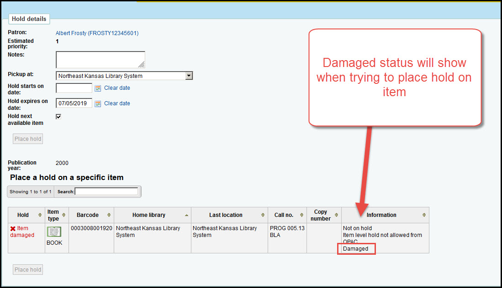

# Holds
<<<<<<< HEAD

## Damaged status in holds information

If you're attempting to place a request on an item that has a "Damaged" status, the status of the item will now display in the "Information" column on the holds page.

This enhancement was created for the new version but it has already been back-ported to our existing system.

=======

>>>>>>> parent of f6a6f97... Added cart, holds, and lists
