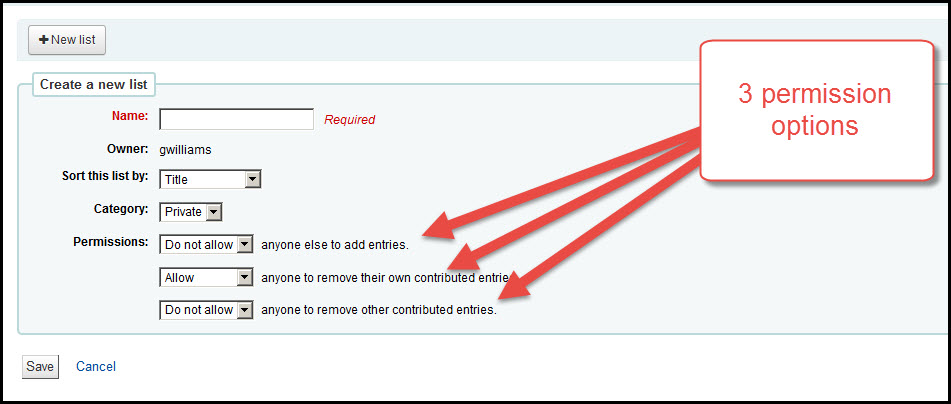
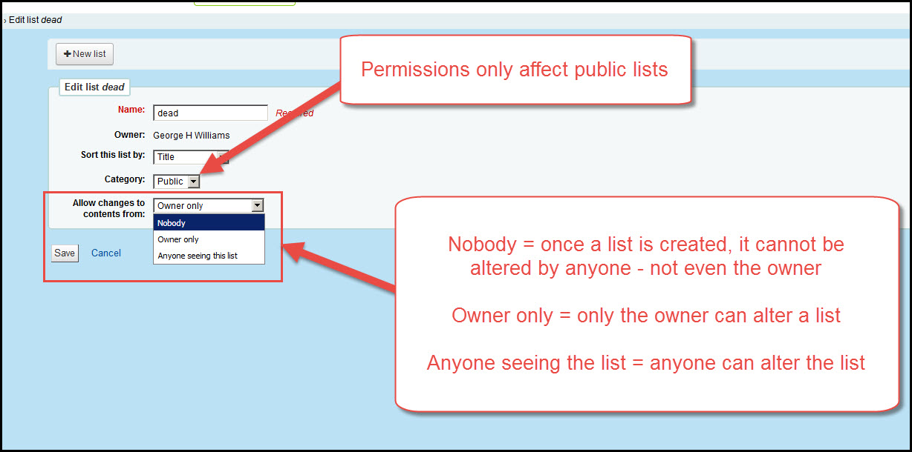
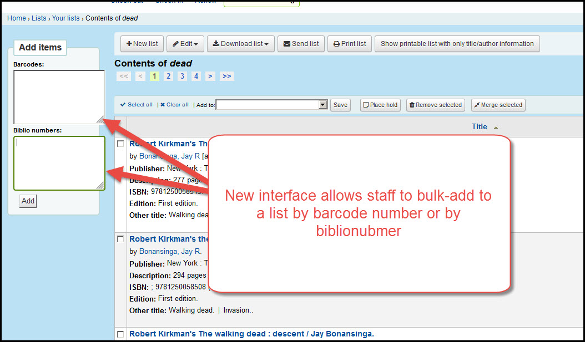

# Lists

***

## Creating a new list

The interface for creating a new list has changed.

The old version had separate controls allowing the list owner to to control whether or not others could add to the list, delete things they had added to the list, or delete things ohters added to a list.  The controls and instructions for using these features were confusing.  The new interface allows staff to create public lists and block all editing (once the list is created even the owner can't take things off of it); give anyone full permission to add or remove items; or to allow only themselves to add or remove items on that list.

Current version:

New version:

***

## Add by biblionumber

Currently titles can be added to a list by barcode number in the lists interface.  In the new version staff can add titles to a list by biblionumber.  This can be particularly helpful for libraries that add titles to the catalog before the items are released.  A report could be created, for example, to list the biblionumbers for all pre-ordered DVD titles at a library so they could bulk-add those titles to a list of upcoming movie releases.

Current version:

New version:

***
