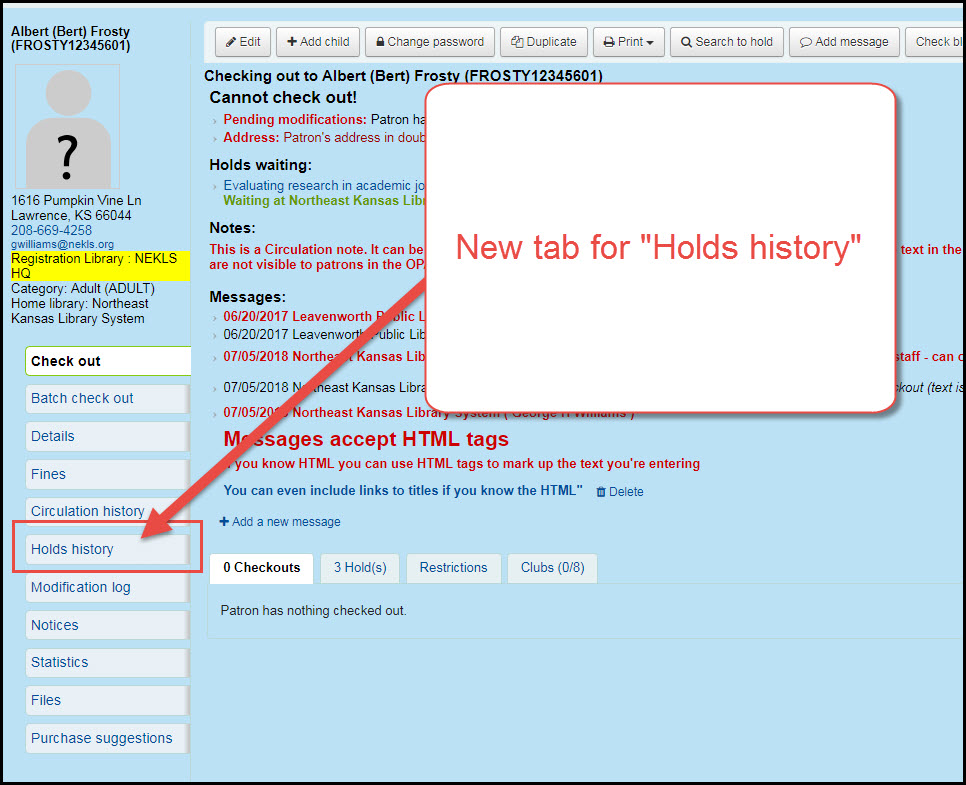

# Patrons

## Holds history

When you view the patron's record in the staff client there will be a new tab for Holds History.

Click on the tab that says "Holds history"

Items that have not arrived say "Pending" Items that have been filled say "Fulfilled" Items that have been cancelled say "Cancelled" Items that are waiting say "Waiting"

Patrons cannot see their own holds history - that function will be in a future version

Patrons cannot delete or anonymize their holds history - that function will also be in a future version

## Suggestion management

Patron purchase suggestions now include a link directly to the patron \(instead of their e-mail address\)

\(show comparison photo from 17.05 vs 17.11\)

## Patron initiated update

If the patron's account is flagged as "Gone no address" by staff and the patron initiates an account update through the OPAC, a flag will now appear on the patron's suggesting updates page showing staff that the "Gone no address" flag has is set for that patron.

\(show comparison photo from 17.05 vs 17.11\)

### Several other changes that affect patrons will be covered in the OPAC section

