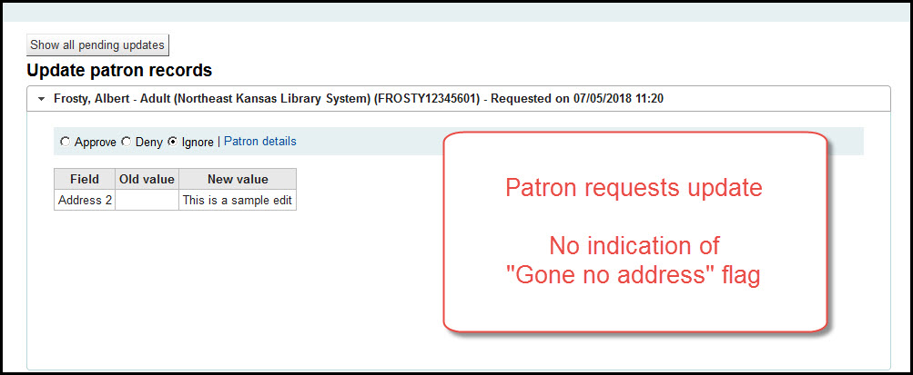

# Patrons

## Holds history

When you view the patron's record in the staff client there will be a new tab for Holds History.

Click on the tab that says "Holds history"

Items that have not arrived will say "Pending." Items that have been filled will say "Fulfilled." Items that have been canceled will say "Canceled." Items that are waiting will say "Waiting."

Patrons cannot see their own holds history - that function will be in a future version

Patrons cannot delete or anonymize their holds history - that function will also be in a future version

## Suggestion management

Patron purchase suggestions now include a link directly to the patron's account instead of their e-mail address.

Current version:

New version:

## Patron initiated update

If the patron's account is flagged as "Gone no address" by staff and the patron initiates an account update through the OPAC, a flag will now appear on the patron's suggesting updates page showing staff that the "Gone no address" flag has is set for that patron.

Current version:

New version:

### Several other changes that affect patrons will be covered in the OPAC section
