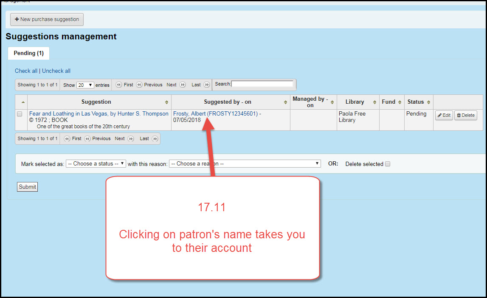
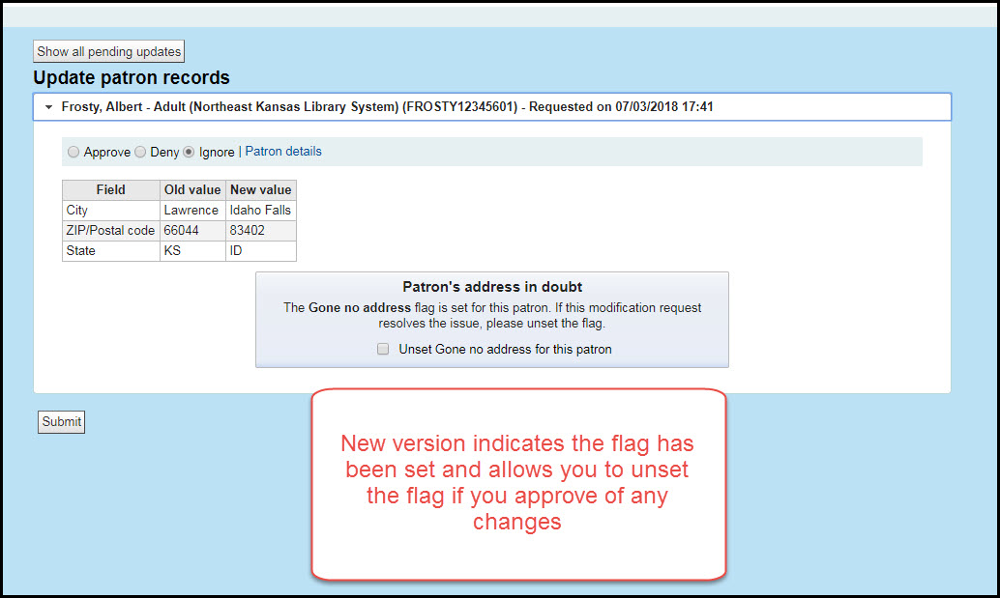

# Patrons

***
## Holds history

### Holds history tab and status

When you view the patron's record in the staff client there will be a new tab for Holds History.

Click on the tab that says "Holds history"

* Items that have not arrived will say "Pending."
* Items that are in transit will say "In transit."
* Items that are waiting will say "Waiting."
* Items that have been picked up and checked out by the patron will say "Fulfilled."
* Items that have been canceled will say "Canceled."

### Holds history duration

A patron's holds history is based on a table in the database called "old_reserves."  This table had been set to have data purged from it once the data was more than 180 days old.  Now that the history is visible to staff, we have re-calibrated this setting to purge data once it is more than 13 months old.  This will make the holds history stay in the catalog for the same length of time as circulation history.  However, since we just changed this setting, we will not have any holds history from before January of 2018.  Once we get to February of 2019, at that point we will have a full 13 months worth of holds history available.

### Holds history in the OPAC and Privacy issues

Patrons cannot see their own holds history - that function will be in a future version

Patrons cannot delete or anonymize their holds history - that function will also be in a future version

***
## Suggestion management

Patron purchase suggestions now include a link directly to the patron's account instead of their e-mail address.

Current version:

New version:

***
## Patron initiated update

If the patron's account is flagged as "Gone no address" by staff and the patron initiates an account update through the OPAC, a flag will now appear on the patron's suggesting updates page showing staff that the "Gone no address" flag has is set for that patron.

Current version:

New version:

***
## Several other changes that affect patrons will be covered in the OPAC section
