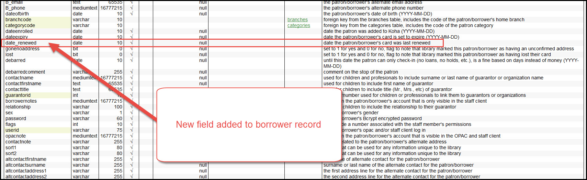
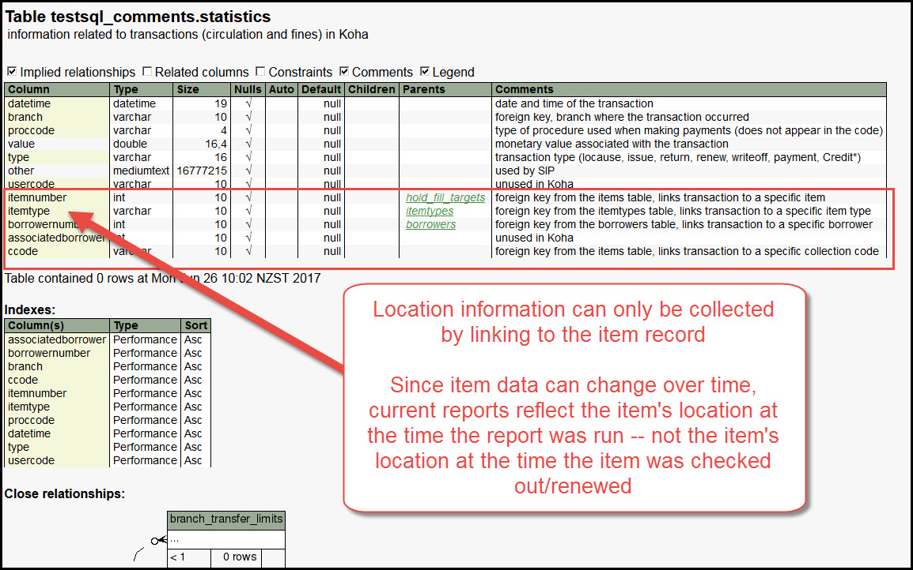

# Reports


***

## Patron renewal statistics

The borrowers table in the database now includes a column for "date_renewed."

Current version:


New version:



This means we can now gather statistics on how many patrons renewed their accounts in a given month and those statistics will start appearing on the monthly statistical report on the August statistics.


The SQL that collects this data is:

``` SQL
SELECT
  branches.branchcode,
  Coalesce(BORROWERSR.COUNT, 0) AS B_RENEWED_LM
FROM
  branches
  LEFT JOIN (SELECT
        borrowers.branchcode,
        Count(*) AS COUNT
      FROM
        borrowers
      WHERE
        Month(borrowers.date_renewed) = Month(Now() - INTERVAL 1 MONTH) AND
        Year(borrowers.date_renewed) = Year(Now() - INTERVAL 1 MONTH)
      GROUP BY
        borrowers.branchcode) BORROWERSR ON branches.branchcode = BORROWERSR.branchcode
GROUP BY
  branches.branchcode
ORDER BY
  branches.branchcode
```

A report number will be assigned to this report after the upgrade (the report won't be added till after the upgrade actually happens).

***

## Account offsets table

Fees and payments are not linked in the current version.  This means it's incredibly difficult to write reports showing which payments correspond to specific fees on a patron's account.


A report with this SQL

```SQL
SELECT
  borrowers.cardnumber,
  payments.timestamp AS PAYMENT_DATE_TIME,
  Format(payments.amount, 2) AS AMT_PAID,
  account_offsets.type AS PAYMENT_TYPE,
  payments.note,
  fees.date AS FEE_DATE,
  Format(fees.amount, 2) AS ORIGINAL_AMT,
  Format(fees.amountoutstanding, 2) AS AMOUNT_STILL_OWED,
  Coalesce(items.barcode, "-") AS ITEM_BC,
  Concat(fees.description, " | ", fees.note) AS FEE_DESCRIPTION_NOTE
FROM
  account_offsets
  JOIN accountlines fees ON fees.accountlines_id = account_offsets.debit_id
  JOIN accountlines payments ON payments.accountlines_id = account_offsets.credit_id
  LEFT JOIN borrowers ON payments.borrowernumber = borrowers.borrowernumber
  LEFT JOIN items ON fees.itemnumber = items.itemnumber
ORDER BY
  PAYMENT_DATE_TIME DESC
```

will return a result like this


This can pave the way to better reporting on fines paid at Library A that are due at Library B.  It will also make PayPal reporting more efficient.

***

## Location code added to statistics table

Item location data (Adult, Childrens, Young adult) is not currently recorded in the statistics table.  This means that if we want data regarding location in our monthly/yearly reports, we have to write complex reports that can change over time.  The new version will move location information into the statistics table at checkout, therefore, monthly statistics should be more accurate.

Current version:



New version:


This will mean a re-write to the reports that collect monthly circulation statistics.  Those reports will be updated after the upgrade.

***
