# Search

***
## Pagination bar

The search results pages have always included a pagination bar at the bottom of the page. It will now be repositioned so that it appears at the top and the bottom of the search results.

Both pagination bars will also now include a "Last" button which will take you to the last page of the results.

Current version:

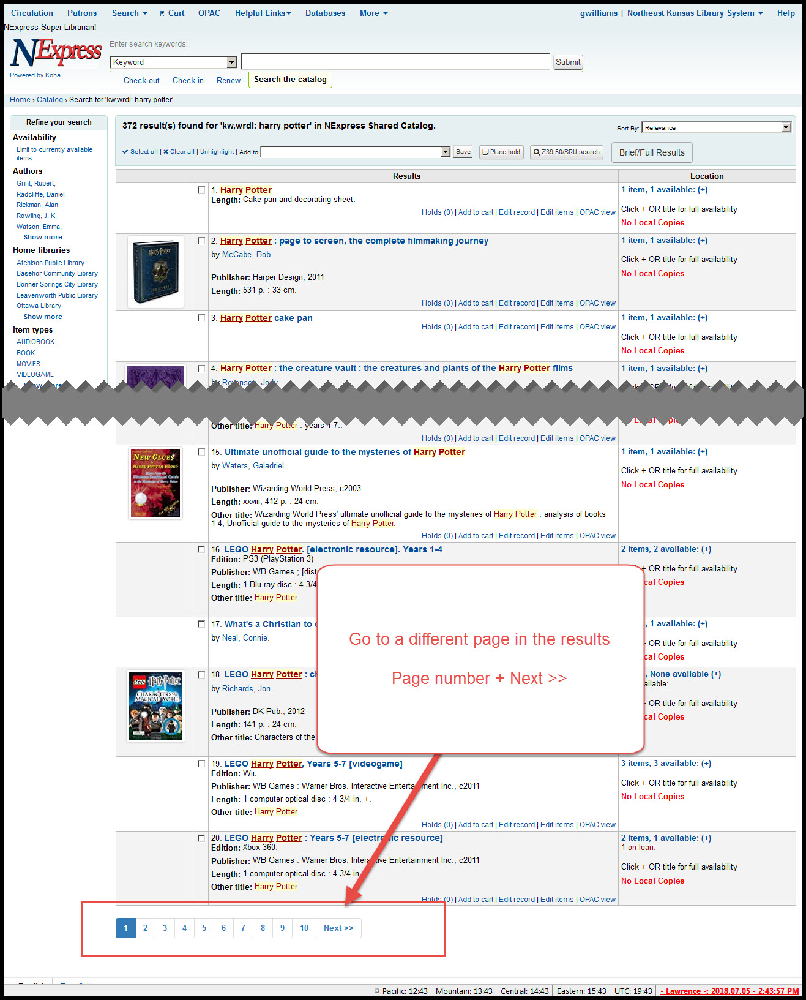

New version:

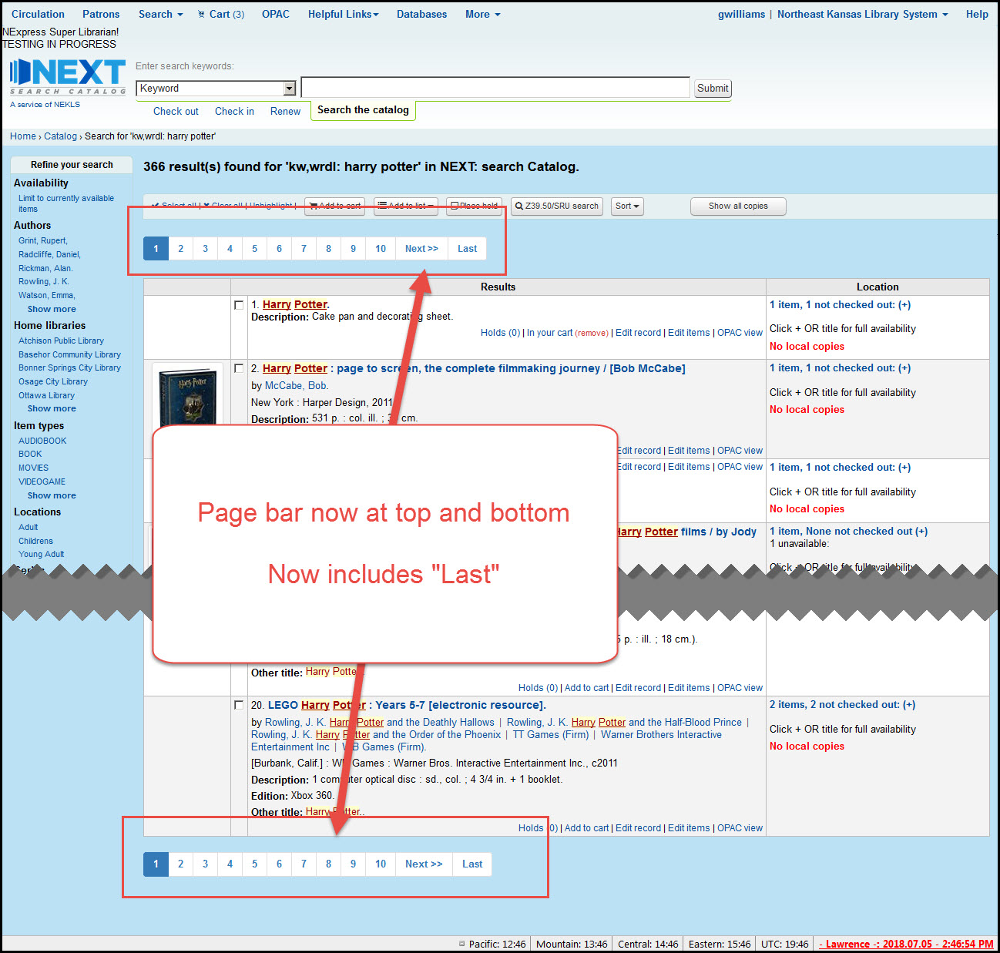

***
## Toolbar changes

There are several changes to the toolbar in the search results. Here are some screenshots to compare.

Current version:

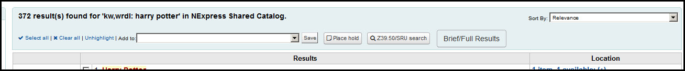

New version:

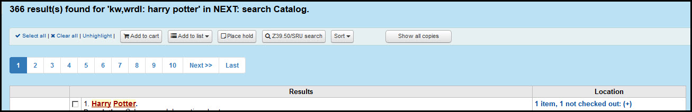

***
### Add to

The add to cart/list dropdown has changed. The new version will have separate buttons for the cart and lists instead of the single dropdown that we now have.

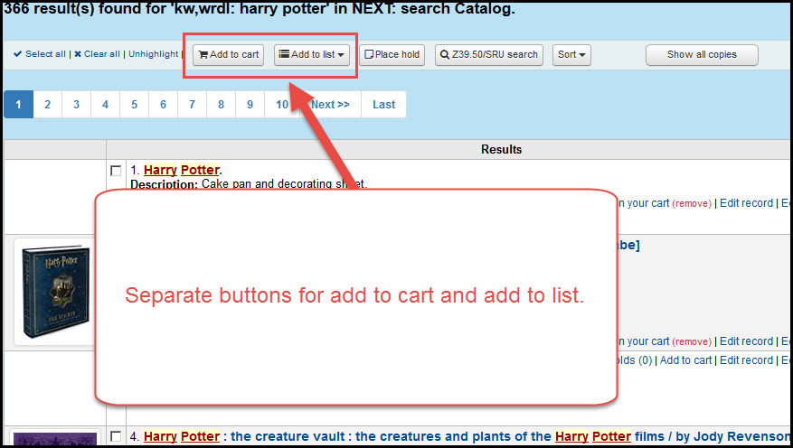

The "Add to list" dropdown which allows you to choose which list to add to will appear once you click on the button and the items are automatically saved to the list you select.

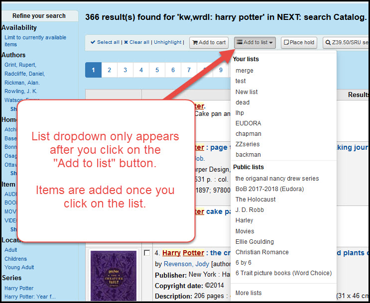

***
### Sort

The dropdown to change the sort order is now also styled as a button. To change the sort order in the new version you click the button and then select the new sorting preference from the dropdown that appears.

Current version:

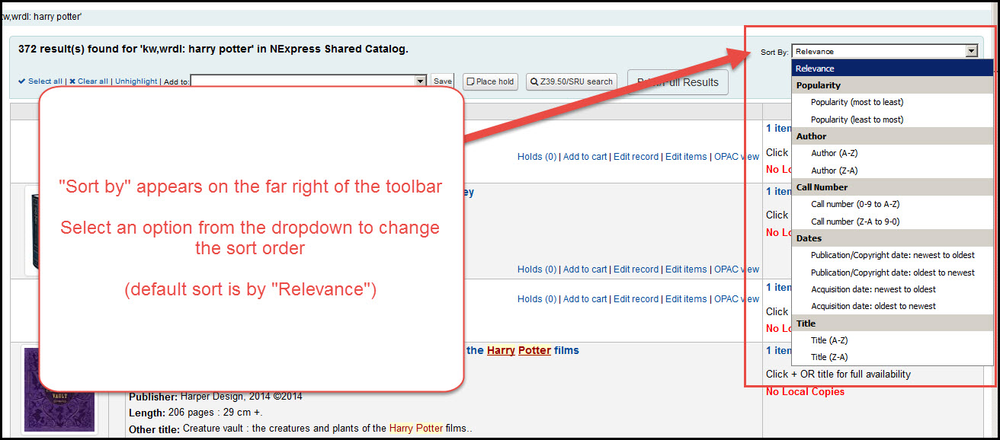

New version:

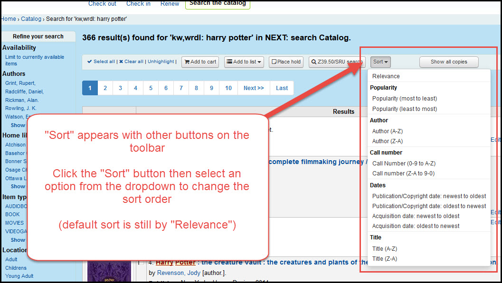

***
### Show all/local copies

The "Brief/Full Results" button has been restyled and is now called "Show all copies" or "Show local copies" depending on the circumstances.

Current version:

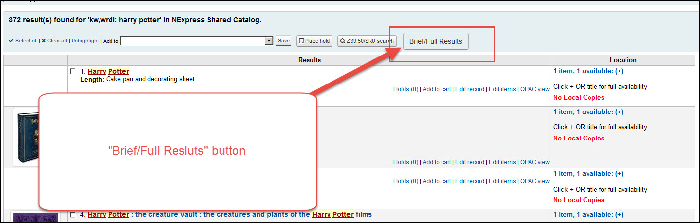

New version:

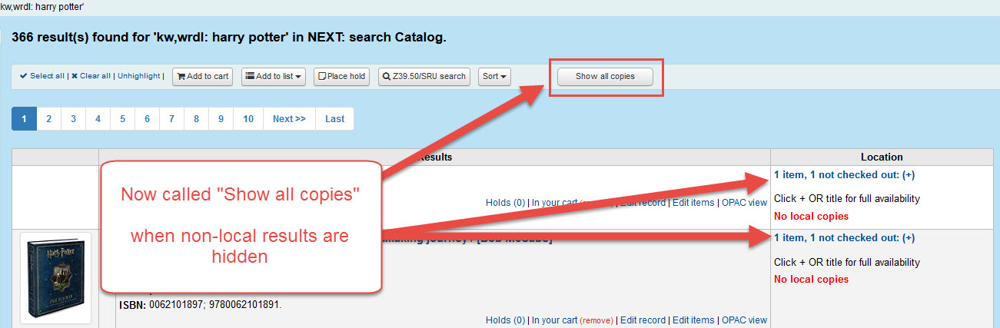

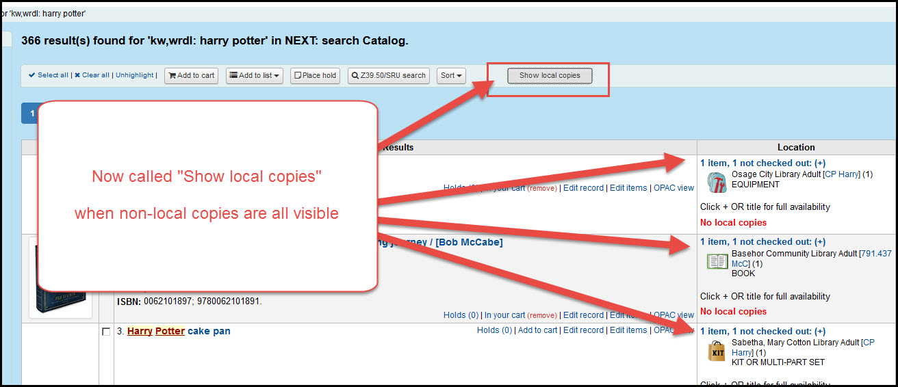

The old button also created an odd situation. If you clicked on the + sign to open an item and then click the "Full/Brief" button, the closed items would toggle to open and the open items would toggle to closed.

In the new version, clicking "Show all copies" opens all copies regardless of whether they were opened or closed when the button was clicked and vice-versa.

***
### Floating Toolbar

The toolbar in the new version will float. In the old version, once you scrolled down the screen, the toolbar disappeared. In the new version, the toolbar will stick to the top of the screen.

Current version:

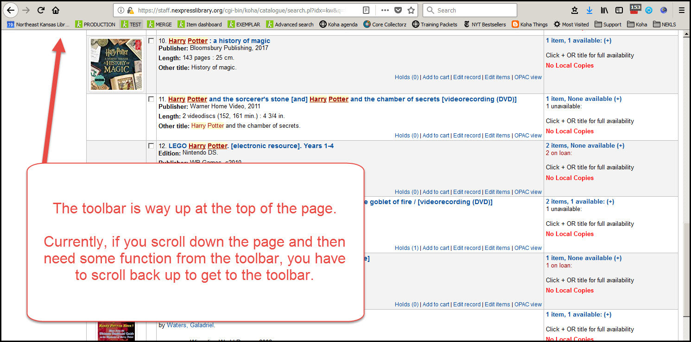

New version:

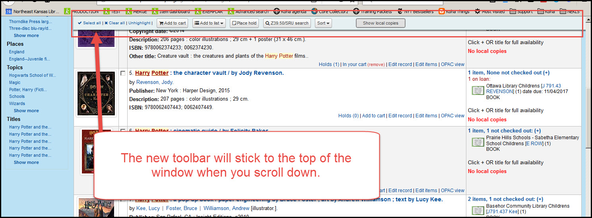

***
